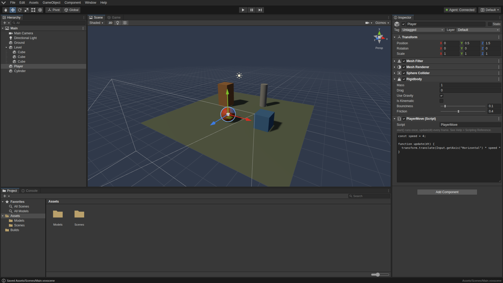

# Vox Studio

[](https://github.com/Flotrpy/Vox-Studio/actions/workflows/ci.yml)

[](package.json)
[](LICENSE)


[](THIRD_PARTY_NOTICES.md)


[](#tests)
[](playwright.config.js)

[](SECURITY.md)

Vox Studio is a browser-based 3D game editor. **Vox Agent** is its small
local helper: a Node.js process you start from a terminal that serves the
editor and does the heavy work (file access, asset conversion, builds) on
your own machine, so the browser tab does not run into its limits.

> Vox Studio is inspired by popular game editors. Not affiliated with or
> endorsed by Unity Technologies. Unity is a trademark of Unity Technologies.



## Requirements

- Node.js 20 or newer. The agent has no npm dependencies; Playwright is a
  dev dependency used only by the browser tests.
- A modern browser with WebGL (Chrome, Edge, Firefox or Safari).

## Running the agent

```
npm start            # same as: node agent/agent.js
```

The console prints something like:

```
Vox Agent v0.1.0

  Studio URL   http://127.0.0.1:8787/#token=Qv8l0iEgw-XKRIvkQzEns8gJGIEO_NukxZ1Mbzn8U_c
  Pairing      Qv8l0iEgw-XKRIvkQzEns8gJGIEO_NukxZ1Mbzn8U_c
  Project      C:\Users\you\VoxProject
```

Open the Studio URL once to pair the editor with the agent. The token is
kept between runs, so a paired browser reconnects after the agent restarts;
`--new-token` issues a new one (unpairing every browser) and `--no-persist`
uses a new, never-stored token on every run.

Options (`node agent/agent.js --help`):

| Option                  | Default               | Meaning                                      |
| ----------------------- | --------------------- | -------------------------------------------- |
| `--port <n>`            | `8787`                | Port on 127.0.0.1                            |
| `--project <dir>`       | `./VoxProject`        | Project folder (created if missing)          |
| `--projects-root <dir>` | parent of `--project` | Where New Project creates projects           |
| `--max-body <mb>`       | `16`                  | Largest accepted request body                |
| `--max-upload <mb>`     | `512`                 | Largest chunked upload                       |
| `--new-token`           | off                   | Issue a new pairing token (unpairs browsers) |
| `--no-persist`          | off                   | New token every run, never stored            |
| `--quiet`               | off                   | Do not log requests                          |

After pairing once, the studio reconnects by itself when you reopen
`http://127.0.0.1:8787/`, even after the agent restarts. The agent watches
the project folder and pushes changes to the Project panel; a scene changed
on disk is reloaded when it has no unsaved edits. Imports, builds and
benchmarks run as background jobs with progress and a cancel button in the
status bar, and large files are uploaded in chunks. File > New Project and
Open Project switch between projects in the projects root.

## The editor

The layout follows the arrangement most game editor users already know:

- **Menu bar**: File, Edit, Assets, GameObject, Component, Window, Help.
- **Toolbar**: Hand, Move, Rotate, Scale, Rect and Transform tools with
  Pivot/Center and Global/Local toggles; Play, Pause, Step; agent status and
  the layout selector.
- **Hierarchy** (left): scene tree with search, create menu, foldouts,
  indent guides, drag to reparent (world position is kept), F2 to rename.
- **Scene / Game** (center): editor camera, grid, click and marquee
  selection, light blue selection outline, transform gizmo, orientation
  gizmo (click an axis to view along it), shading modes, 2D mode, lighting
  and gizmo toggles. The Game tab renders through the main camera with an
  aspect ratio dropdown and a stats overlay.
- **Inspector** (right): active checkbox, name, Static, Tag, Layer, component
  foldouts with enable checkboxes and overflow menus, Vector3 fields with
  drag-to-scrub X/Y/Z labels, color fields, Add Component.
- **Project / Console** (bottom): folder tree, breadcrumb, asset grid with
  zoom slider (far left switches to a list), search; console with Clear,
  Collapse, Clear on Play, Error Pause and per-type filters with counts.

Panels dock: drag a tab onto another tab strip, onto the edge of a panel or
onto the edge of the window. Drag splitters to resize. Close tabs from the
tab's context menu and reopen them from the Window menu. The layout is saved
in browser storage (`vox:layout`) and restored on the next visit.

Without a paired agent the editor still runs: scenes are kept in browser
storage and can be downloaded or loaded as `.voxscene` files from the File
menu.

### Scene navigation

| Input                          | Action                              |
| ------------------------------ | ----------------------------------- |
| Right drag + W A S D Q E       | Fly (Shift = faster, wheel = speed) |
| Alt + left drag                | Orbit                               |
| Middle drag (or Hand tool)     | Pan                                 |
| Wheel, Alt + right drag        | Zoom                                |
| F, or double-click             | Frame selection                     |
| Ctrl while dragging a handle   | Snap                                |

### Shortcuts

Q W E R T Y tools, Z pivot/center, X global/local, F frame, Delete, Ctrl+D
duplicate, Ctrl+C/Ctrl+V, F2 rename, Ctrl+Z / Ctrl+Y undo/redo, Ctrl+S save,
Ctrl+Shift+S save as, Ctrl+N new scene, Ctrl+P play. Help > Keyboard
Shortcuts lists them all.

## Play mode

Press Play (Ctrl+P). The editor snapshots the scene, switches to the Game
view and runs physics and scripts; Pause and Step work as usual, and the
toolbar and viewports are tinted while playing. Stop restores the snapshot,
so anything changed during play (by the simulation or by hand) is
discarded.

- **Rigidbody** adds gravity, drag, bounciness and friction.
- **Box Collider / Sphere Collider** collide (axis-aligned; bodies do not
  rotate) or act as triggers with Is Trigger.
- **Mesh Collider** collides against the exact triangles of the object's
  Mesh Filter mesh, for terrain, ramps and imported level geometry. It
  works on static and kinematic objects; on a moving Rigidbody it falls
  back to a box around the mesh.
- **Script** components hold JavaScript. Help > Scripting Reference lists
  the API:

```js
const speed = 4;

function start() {
  Debug.log("Hello from " + gameObject.name);
}

function update(dt) {
  transform.translate(Input.getAxis("Horizontal") * speed * dt, 0, -Input.getAxis("Vertical") * speed * dt);
  if (Input.getKeyDown("space") && rigidbody) rigidbody.addForce(0, 5, 0, "impulse");
}

function onCollisionEnter(other) {
  Debug.log("Hit " + other.name);
}
```

Script errors go to the Console with the object and script name; with Error
Pause on, play pauses on the first error.

## Importing models

Assets > Import New Asset (or drop files on the Project panel) accepts
`.obj`, `.gltf` (with embedded buffers) and `.glb`. With the agent running,
conversion happens in the agent process and the result is written to
`Assets/Models/*.voxmesh`; glTF node hierarchies and base colors are kept.
Drag a `.voxmesh` from the Project panel into the Scene view or Hierarchy
to place it.

## Building a standalone game

File > Build Settings, then Build or Build And Run (Ctrl+B). The agent writes
`Builds/<Scene>/play.html`: one file containing the engine, your scripts and
the scene. Open it in any modern browser, no server needed. Build And Run
opens it right away through a one-time link from the agent.

## Agent panel

Window > Agent (or click the agent status in the toolbar) shows the
machine's memory and CPU as reported by the agent and runs the CPU and
memory benchmarks.

## Project folder

```
VoxProject/
  Assets/
    Scenes/        .voxscene files
    Models/        .voxmesh files produced by asset import
  Builds/          standalone exports (<Scene>/play.html)
  .vox/
    ProjectSettings.json
```

## Tests

| Command               | What it runs                                                   |
| --------------------- | -------------------------------------------------------------- |
| `npm test`            | Unit tests with Node's built-in runner (`node --test`)         |
| `npm run test:e2e`    | Browser tests (Playwright, Chromium)                           |
| `npm run test:visual` | Screenshot baselines, see [docs/UI_REFERENCE.md](docs/UI_REFERENCE.md) |
| `npm run test:all`    | Unit tests, then browser tests                                 |

The unit tests cover agent security (token, Origin, Host, path traversal,
size limits, build export), the scene format and serialization, the OBJ and
glTF parsers, the scene model and undo/redo, dock layout, and physics and
scripting. The browser tests cover editing, docking, play mode, builds and
the layout metrics at 1920x1080 and 1366x768. Install Chromium once before
the first browser run:

```
npx playwright install chromium
```

CI ([`.github/workflows/ci.yml`](.github/workflows/ci.yml)) runs the unit
tests on Node 20 and 22, then the browser tests, on every pull request and
every push to `main`.

## Architecture

See [docs/ARCHITECTURE.md](docs/ARCHITECTURE.md) for how the studio, the
shared format code and the agent fit together.

## Roadmap

- Rotated (oriented) box colliders and rigid body rotation
- Textures and materials in glTF import; texture assets in the Project panel
- Prefabs and multi-object editing in the Inspector
- Audio sources and listeners
- Multiple scenes in one build, scene loading from scripts
- Lightmapping and baked ambient occlusion jobs in the agent
- Optional script editor with syntax highlighting

## Security

See [SECURITY.md](SECURITY.md) for the agent's threat model.

## License

MIT, see [LICENSE](LICENSE). Third-party components are listed in
[THIRD_PARTY_NOTICES.md](THIRD_PARTY_NOTICES.md).
